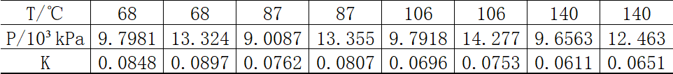
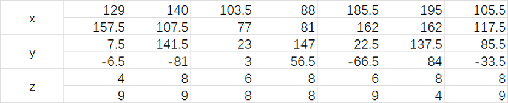

# 实验八　插值与拟合

## 习题

1. **丙烷的导热系数**

   &emsp;&emsp;在化工生产中常常需要知道丙烷在各种温度$T$和压力$P$下的导热系数$K$。下面是实验得到的一组数据：

   

   试求$T=99℃ \bigwedge P=10.3\times10^3kPa$下的$K$。

   ``` matlab
   T = [68 68 87 87 106 106 140 140];
   P = [9.7981 13.324 9.0087 13.355 9.7918 14.277 9.6563 12.463];
   K = [0.0848 0.0897 0.0762 0.0807 0.0696 0.0753 0.0611 0.0651];
   cT = 99;
   cP = 10.3;
   K = griddata(T, P, K, cT, cP, "cubic")
   ```

2. **危险的海域**

   &emsp;&emsp;下表给出了某一海域以码为单位的直角坐标系$Oxy$上一点$(x, y)$（水面一点）以英尺为单位的水深$z$，水深数据是在低潮时测得的，船的吃水深度为5英尺。问在矩形区域$(75, 200)\times(-50, 100)$里哪些地方船要避免进入。

   

   ``` matlab
   x = [129 140 103.5 88 185.5 195 105.5 ...
      157.5 107.5 77 81 162 162 117.5];
   y = [7.5 141.5 23 147 22.5 137.5 85.5 ...
      -6.5 -81 3 56.5 -66.5 84 -33.5];
   z = [4 8 6 8 6 8 8 ...
      9 9 8 8 9 4 9];
   cx = 75 : 0.5 : 200;
   cy = -50 : 0.5 : 200;
   [Xi, Yi] = meshgrid(cx, cy);
   Zi = griddata(x, y, z, Xi, Yi, "cubic");
   contourf(Xi, Yi, Zi, 'ShowText', "on");
   xlim([75 200]);
   ylim([-50, 150]);
   ```
