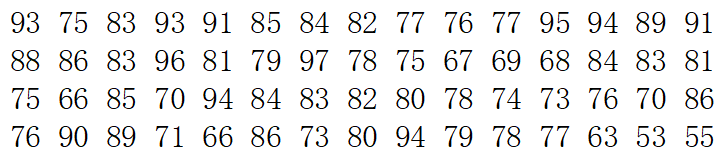

# 实验九　数据的统计描述

## 习题

1. 某校60名学生的一次考试成绩如下：

   

   1. 计算均值、标准差、极差、偏度、峰度，画出直方图；

      ``` matlab
      % 输入数据
      data = [ ...
         93 75 83 93 91 85 84 82 77 76 77 95 94 89 91 ...
         88 86 83 96 81 79 97 78 75 67 69 68 84 83 81 ...
         75 66 85 70 94 84 83 82 80 78 74 73 76 70 86 ...
         76 90 89 71 66 86 73 80 94 79 78 77 63 53 55 ...
      ]';

      % 输出结果
      sprintf( ...
         "均值为%f，标准差为%f，极差为%d，偏度为%f，峰度为%f。", ...
         mean(data), ...
         std(data), ...
         max(data) - min(data), ...
         skewness(data), ...
         kurtosis(data) ...
      )

      % 绘制直方图
      histogram(data);
      grid on
      title("各分数的人数直方图");
      ```

   2. 检验分布的正态性；

      ``` matlab
      % 正态性检验
      normplot(data);
      ```

   3. 若检验符合正态分布，估计正态分布的参数并检验参数。

      ``` matlab
      % 正态性参数估计
      [mu, sigma, muci, sigmaci] = normfit(data);
      sprintf( ...
         "估算的正态分布均值为%f，方差为%f，\n" + ...
         "均值的0.95置信区间为%f～%f，\n" + ...
         "方差0.95置信区间为%f～%f", ...
         mu, sigma, muci, sigmaci ...
      )

      % 假设检验
      [h, sig, ci] = ttest(data, mu);
      sprintf( ...
         "均值为%f的假设拒绝值为%d，0.95置信区间为%f～%f", ...
         mu, h, ci ...
      )
      ```

## 后记

&emsp;&emsp;以上代码的所有输出详见[MATLAB Live Script 实时脚本](Task9.mlx)。
