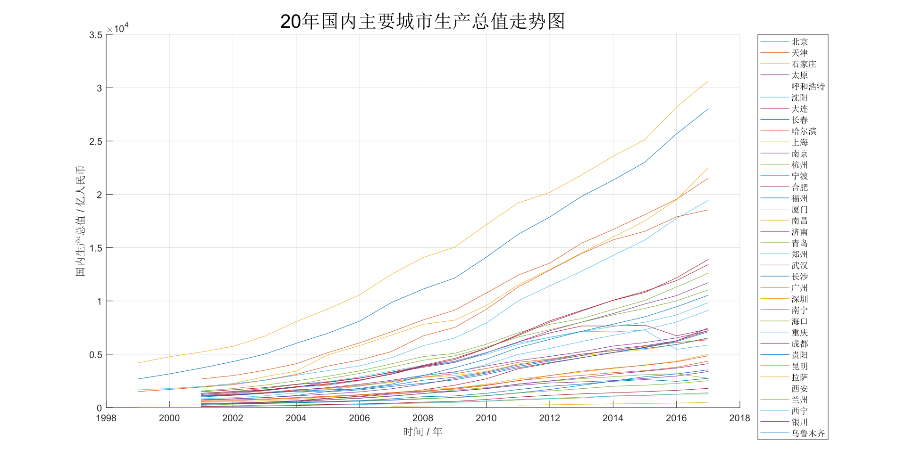
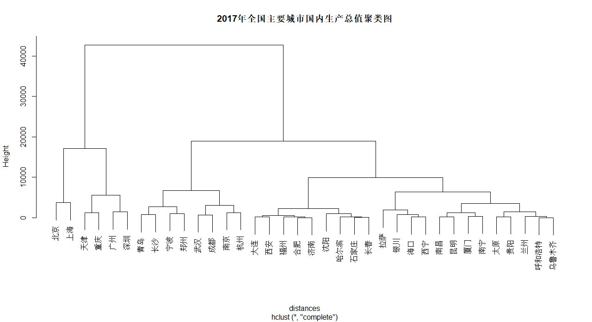
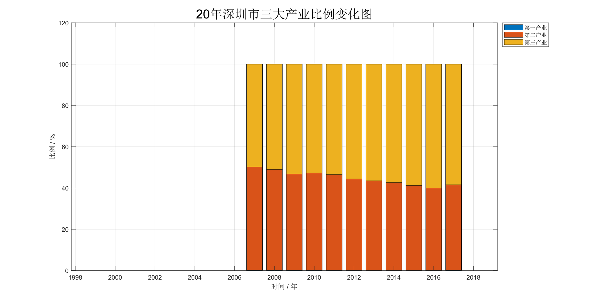

# 探究广深两市的综合发展动力

## 摘要

&emsp;&emsp;以广州市、深圳经济特区为代表的粤港澳大湾区，以上海市为代表的长江三角洲经济圈，以北京市、天津市为代表的京津冀经济圈是全国发展速度最快的三大经济圈。其中，粤港澳大湾区城市密集、人口密度高，逐渐成为中国经济的领头羊。

&emsp;&emsp;粤港澳大湾区世界级城市群，既是粤港澳区域经济社会文化自身发展的内在需要，也是国家区域发展战略的重要构成与动力支撑点，承载着辐射带动泛珠三角区域合作发展的战略功能。同时，也是国家借助港澳国际窗口构建开放型经济新体制的重要探索，是建设“一带一路”战略枢纽、构建“走出去”“引进来”双向平台的重要区域支点；此外，也是构建港澳经济长远发展动力，成功实践“一国两制”、达致港澳长远繁荣稳定和凝聚港澳向心力的重要措施。

&emsp;&emsp;知晓优势所在、定位决定性因素、准确预测未来发展趋势，对广深两地乃至粤港澳大湾区发展具有重要意义。“知己知彼，百战不殆”，尽管当下不再是硝烟弥漫的战争年代，但深入了解区位优势必然有利于广深两地指引粤港澳大湾区发展方向，让大湾区经济水平达到全新的高度。

## 关键词

&emsp;&emsp;大湾区；城市群；对外开放；区位优势；经济发展；

## 正文

### 一、概念字典

1. 生产法

    &emsp;&emsp;国内生产总值（Gross Domestic Product，GDP）指按市场价格计算的一个国家（或地区）所有常住单位在一定时期内生产活动的最终成果，常被公认为衡量国家或地区经济状况的最佳指标。国家统计局采用生产法进行国内生产总值核算。

    &emsp;&emsp;生产法，又叫部门法，是从生产的角度衡量常住单位在核算期内新创造价值的一种方法，即从国民经济各个部门在核算期内生产的总产品价值中，扣除生产过程中投入的中间产品价值，得到增加值。卫生、教育、行政、家庭服务等部门无法计算增值，则按照工资收入来计算其服务的价值。

    &emsp;&emsp;生产法计算国内生产总值的公式如下：
    $$ G = L + N + D + O $$
    其中，$L$为劳动者报酬、$N$为生产税净额、$D$为固定资产折旧、$O$为营业盈余。

2. 年均经济增长率

    &emsp;&emsp;经济增长率（Economic Growth Rate）是末期国民生产总值与基期国民生产总值的比较，其数值的大小意味着经济增长的快慢、意味着人民生活水平提高所需的时间长短。

    &emsp;&emsp;几何年均经济增长率衡量的是若干年来经济的平均变化情况，计算公式定义如下：
    $$ \Large R_{P} = \sqrt[n]{\frac{G_{n}}{G_{0}}} - 1 $$
    其中，$R_{P}$为几何年均经济增长率，$n$为时间间隔，$G_{n}$为第$n$年的国内生产总值，$G_{0}$为初始国内生产总值，。

3. 聚类分析模型

    &emsp;&emsp;聚类分析法（Cluster Analysis）是研究“物以类聚”的一种现代统计分析方法，在社会生活的众多领域中，都需要采用聚类分析作分类研究。聚类分析的目的是把分类对象按一定规则分成若干类，这些类不是事先设定的，而是根据数据的特征确定的。在同一类中这些对象在某种意义上趋向于彼此相似，而在不同类中的对象趋向于不相似。

    &emsp;&emsp;系统聚类法的分类依据是样品之间的距离和在其上定义的类间距离。将$n$个样品独立地分为$n$个类，每次将具有最小距离的两类合并，合并后重新计算类间距离，直到所有样品归为一类。将这个过程绘制成一张聚类图，参照聚类图就可以实现快速分类了。由于聚类图与系统图极为相似，所以这种聚类方法也被称为系统聚类法（Hierarchical Clustering Method）。

    &emsp;&emsp;最短距离法定义类与类之间的距离为两类最近的样品之间的距离，该方法用如下公式刻画类$G_{p}$与类$G_{q}$中最邻近的两个样品的距离：
    $$ D_{k}(p, q) = \min{ \left\\\{ d_{ij} \vert i \in G_{p}, j \in G_{q} \right\\\} } $$

    &emsp;&emsp;若类$G_{p}$与类$G_{q}$合并为$G_{r}$，则$G_{r}$与其他类$G_{s}$的距离为：
    $$ D_{k}(r, s) = \min{ \left\{ D_{k}(p, s), D_{k}(q, s) \right\} } $$

### 二、广深两地的经济发展优势

&emsp;&emsp;中华文化是一种农耕文化。历朝历代，华夏文明的政治、经济中心长期处于中原地区。珠江三角洲地处亚热带，纬度较低，自然环境闷热潮湿，中原人无法适应当地环境，造成珠江三角洲经济发展滞后。1979年，深圳经济特区成立。从那时起，深圳便从一个不起眼的渔村开始，逐渐演变为一个现代化大型城市。但是深圳在历史上政治、经济地位不高，即使创造了“深圳速度”的神话传说，也没有强势的政治、经济政策吸引国内外顶尖人才。

&emsp;&emsp;1994年，时任香港科技大学校长吴家玮提出，建设深港湾区以对标美国旧金山。二十一世纪初，广州市率先提出依托南沙港进行发展，对标日本东京湾区。2009年10月28日，粤港澳三地政府有关部门在澳门特别行政区联合发布《大珠江三角洲城镇群协调发展规划研究》，提出构建珠江口湾区，凭借粤港澳三地的经济与区位优势共同建立世界级城镇群。

&emsp;&emsp;2001年，广州市国内生产总值为2685.76亿元人民币，深圳市国内生产总值为1954.17亿元人民币。在2001年～2017年的17年间，广州市和深圳市国民生产总值定基增长率分别为700.64%和1050.88%，年均增长率分别为13.02%和15.46%。对比之下，深圳经济发展水平和经济增速都在广州之上，拥有更好的发展潜能。

&emsp;&emsp;通过对2017年国内生产总值进行聚类分析可以看出，广州、深圳、北京、上海、天津、重庆共6个城市聚集为一类。这一类属于全国一线城市，经济发展迅速，区位优势明显。

