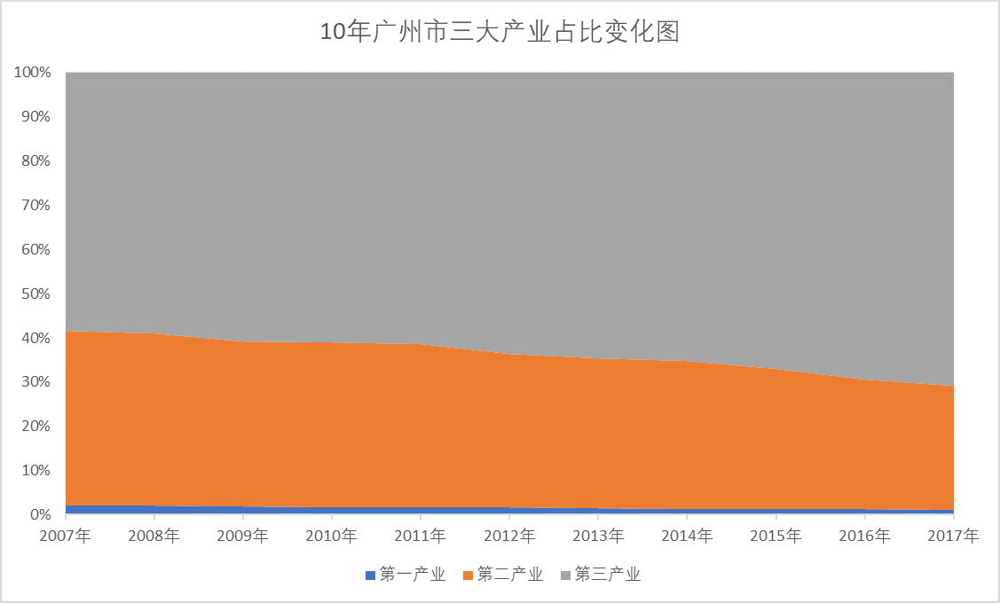
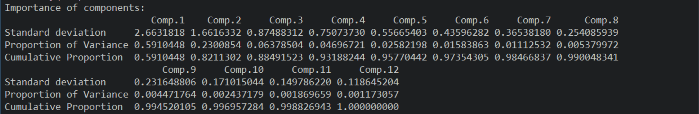
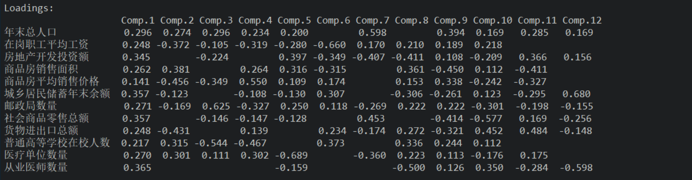
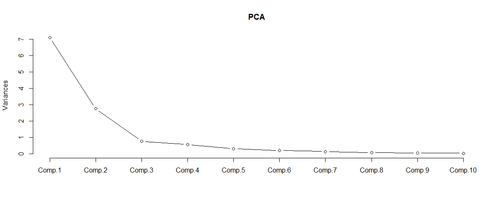
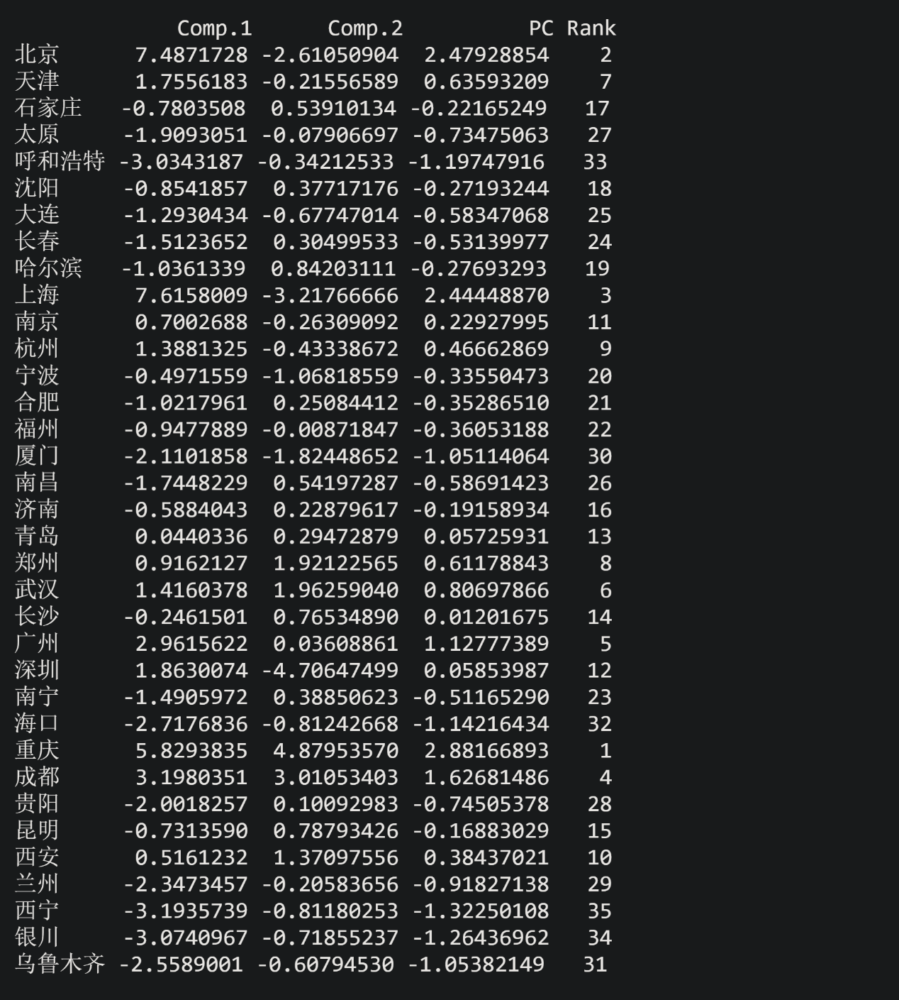

# 探究广深两市的综合发展动力

## 摘要

&emsp;&emsp;以广州市、深圳经济特区为代表的粤港澳大湾区，以上海市为代表的长江三角洲经济圈，以北京市、天津市为代表的京津冀经济圈是全国发展速度最快的三大经济圈。其中，粤港澳大湾区城市密集、人口密度高，逐渐成为中国经济的领头羊。

&emsp;&emsp;粤港澳大湾区世界级城市群，既是粤港澳区域经济社会文化自身发展的内在需要，也是国家区域发展战略的重要构成与动力支撑点，承载着辐射带动泛珠三角区域合作发展的战略功能。同时，也是国家借助港澳国际窗口构建开放型经济新体制的重要探索，是建设“一带一路”战略枢纽、构建“走出去”“引进来”双向平台的重要区域支点；此外，也是构建港澳经济长远发展动力，成功实践“一国两制”、达致港澳长远繁荣稳定和凝聚港澳向心力的重要措施。

&emsp;&emsp;知晓优势所在、定位决定性因素、准确预测未来发展趋势，对广深两地乃至粤港澳大湾区发展具有重要意义。“知己知彼，百战不殆”，尽管当下不再是硝烟弥漫的战争年代，但深入了解区位优势必然有利于广深两地指引粤港澳大湾区发展方向，让大湾区经济水平达到全新的高度。

**关键词：大湾区；城市群；对外开放；区位优势；经济发展；**

## 目录

- [摘要](#摘要)
- [目录](#目录)
- [正文](#正文)
  - [1. 概念字典](#1-概念字典)
    - [1.1. 生产法](#11-生产法)
    - [1.2. 年均经济增长率](#12-年均经济增长率)
    - [1.3. 聚类分析模型](#13-聚类分析模型)
    - [1.4. 国内主要城市](#14-国内主要城市)
    - [1.5. 主成分分析法](#15-主成分分析法)
  - [2. 广深两地的经济发展优势](#2-广深两地的经济发展优势)
  - [3. 影响广深两地经济的主要因素](#3-影响广深两地经济的主要因素)
- [参考文献](#参考文献)

## 正文

### 1. 概念字典

#### 1.1. 生产法

&emsp;&emsp;国内生产总值（Gross Domestic Product，GDP）指按市场价格计算的一个国家（或地区）所有常住单位在一定时期内生产活动的最终成果，常被公认为衡量国家或地区经济状况的最佳指标。国家统计局采用生产法进行国内生产总值核算。

&emsp;&emsp;生产法，又叫部门法，是从生产的角度衡量常住单位在核算期内新创造价值的一种方法，即从国民经济各个部门在核算期内生产的总产品价值中，扣除生产过程中投入的中间产品价值，得到增加值。卫生、教育、行政、家庭服务等部门无法计算增值，则按照工资收入来计算其服务的价值。

&emsp;&emsp;生产法计算国内生产总值的公式如下：
$$G = L + N + D + O$$
其中，$L$为劳动者报酬、$N$为生产税净额、$D$为固定资产折旧、$O$为营业盈余。

#### 1.2. 年均经济增长率

&emsp;&emsp;经济增长率（Economic Growth Rate）是末期国民生产总值与基期国民生产总值的比较，其数值的大小意味着经济增长的快慢、意味着人民生活水平提高所需的时间长短。

&emsp;&emsp;几何年均经济增长率衡量的是若干年来经济的平均变化情况，计算公式定义如下：
$$\Large R_{P} = \sqrt[n]{\frac{G_{n}}{G_{0}}} - 1$$
其中，$R_{P}$为几何年均经济增长率，$n$为时间间隔，$G_{n}$为第$n$年的国内生产总值，$G_{0}$为初始国内生产总值。

#### 1.3. 聚类分析模型

&emsp;&emsp;聚类分析法（Cluster Analysis）是研究“物以类聚”的一种现代统计分析方法，在社会生活的众多领域中，都需要采用聚类分析作分类研究。聚类分析的目的是把分类对象按一定规则分成若干类，这些类不是事先设定的，而是根据数据的特征确定的。在同一类中这些对象在某种意义上趋向于彼此相似，而在不同类中的对象趋向于不相似。

&emsp;&emsp;系统聚类法的分类依据是样品之间的距离和在其上定义的类间距离。将$n$个样品独立地分为$n$个类，每次将具有最小距离的两类合并，合并后重新计算类间距离，直到所有样品归为一类。将这个过程绘制成一张聚类图，参照聚类图就可以实现快速分类了。由于聚类图与系统图极为相似，所以这种聚类方法也被称为系统聚类法（Hierarchical Clustering Method）。

&emsp;&emsp;最短距离法定义类与类之间的距离为两类最近的样品之间的距离，该方法用如下公式刻画类$G_{p}$与类$G_{q}$中最邻近的两个样品的距离：
$$ D_{k}(p, q) = \min{ \left\\\{ d_{ij} \\\; \vert \\\; i \in G_{p}, j \in G_{q} \right\\\} } $$

&emsp;&emsp;若类$G_{p}$与类$G_{q}$合并为$G_{r}$，则$G_{r}$与其他类$G_{s}$的距离为：
$$ D_{k}(r, s) = \min{ \left\\\{ D_{k}(p, s), D_{k}(q, s) \right\\\} } $$

#### 1.4. 国内主要城市

&emsp;&emsp;“国内主要城市”指在国家统计局拥有单列数据的城市，包括北京、天津、石家庄、太原、呼和浩特、沈阳、大连、长春、哈尔滨、上海、南京、杭州、宁波、合肥、福州、厦门、南昌、济南、青岛、郑州、武汉、长沙、广州、深圳、南宁、海口、重庆、成都、贵阳、昆明、拉萨、西安、兰州、西宁、银川、乌鲁木齐，累计36个行政区划。

&emsp;&emsp;这36个城市都在经济发展上拥有突出表现，基本代表了各省/自治区/直辖市经济发展的最高水平，可作为数据实例使用。

#### 1.5. 主成分分析法

&emsp;&emsp;主成分分析（Principal Component Analysis，PCA）市将多指标化为少数几个综合指标的一种统计分析方法，是由Pearson（1901）提出，后被Hotelling（1993）发展起来的。主成分分析是通过降维技术把多个变量化为少数几个主成分的方法，这些主成分保留原始变量的绝大部分信息，它们通常表示为原始变量的线性组合。

&emsp;&emsp;主成分分析的成分$y_i$和原来变量$x_i$之间的关系为（假定原先有$p$个变量）

$$
\begin{cases}
y_1=u_{11}x_1+u_{12}x_2+\dotsb+u_{p1}x_p=u_1'x \\
y_2=u_{12}x_1+u_{22}x_2+\dotsb+u_{p2}x_p=u_2'x \\
\vdots \\
y_p=u{p1}x_1+u_{p2}x_2+\dotsb+u_{pp}x_p=u_p'x
\end{cases}
$$

### 2. 广深两地的经济发展优势

&emsp;&emsp;中华文化是一种农耕文化。历朝历代，华夏文明的政治、经济中心长期处于中原地区。珠江三角洲地处亚热带，纬度较低，自然环境闷热潮湿，中原人无法适应当地环境，造成珠江三角洲经济发展滞后。1979年，深圳经济特区成立。从那时起，深圳便从一个不起眼的渔村开始，逐渐演变为一个现代化大型城市。但是深圳在历史上政治、经济地位不高，即使创造了“深圳速度”的神话传说，也没有强势的政治、经济政策吸引国内外顶尖人才。

&emsp;&emsp;1994年，时任香港科技大学校长吴家玮提出，建设深港湾区以对标美国旧金山。二十一世纪初，广州市率先提出依托南沙港进行发展，对标日本东京湾区。2009年10月28日，粤港澳三地政府有关部门在澳门特别行政区联合发布《大珠江三角洲城镇群协调发展规划研究》，提出构建珠江口湾区，凭借粤港澳三地的经济与区位优势共同建立世界级城镇群。

&emsp;&emsp;2001年，广州市国内生产总值为2685.76亿元人民币，深圳市国内生产总值为1954.17亿元人民币。在2001年～2017年的17年间，广州市和深圳市国民生产总值定基增长率分别为700.64%和1050.88%，年均增长率分别为13.02%和15.46%。对比之下，深圳经济发展水平和经济增速都在广州之上，拥有更好的发展潜能。

&emsp;&emsp;通过对2017年国内生产总值进行聚类分析可以看出，广州、深圳、北京、上海、天津、重庆共6个城市聚集为一类。这一类属于全国一线城市，经济发展迅速，区位优势明显。

&emsp;&emsp;深圳经济特区临近香港特别行政区，从经济特区建立时开始至今陆续建立了罗湖口岸、深圳湾口岸、福田口岸、皇岗口岸、宝安国际机场口岸、文锦渡口岸、沙头角口岸、太子湾口岸、西九龙口岸等9个边检口岸。作为内地与香港之间的“边境缓冲区”，深圳起到了重要的枢纽功能。改革开放40年间，深圳不断地加强与香港的跨境合作与交流，经济发展水平空前地迅速。

&emsp;&emsp;2007年，深圳市三大产业占比分别为0.1%、50.06%、49.84%；2017年又为0.09%、41.44%、58.47%。在这10年中，深圳市发现了当下最为合理的产业分配形式，第二产业不断向第三产业转型。

&emsp;&emsp;与深圳市不同，广州市的产业分配存在明显的偏向性。2007年，广州市三大产业占比分别为2.11%、39.48%、58.41%；2017年，比例调整为1.09%、27.97%、70.94%。尽管广州市也选择了以第三产业作为支柱产业，但第二、第三产业之间的不均衡让广州市产生短板，发展后劲不足，让深圳市在2018年实现反超。

### 3. 影响广深两地经济的主要因素

&emsp;&emsp;以2017年为时间基准，从国家统计局获取来自35个主要城市（拉萨没有相应的统计数据，将其忽略）的12项指标，包括年末总人口数量（万人）、在岗职工平均工资（人民币）、房地产开发投资额（亿人民币）、商品房销售面积（万平方米）、商品房平均销售价格（人民币/平方米）、城乡居民储蓄年末余额（亿人民币）、邮政局数量（所）、社会商品零售总额（亿人民币）、货物进出口总额（百万美元）、普通高等学校在校学生数量（万人）、医院、卫生院数量（个）、执业/助理医师人数（万人）。

&emsp;&emsp;对以上数据进行主成分分析并计算相应的主成分载荷。

&emsp;&emsp;根据主成分分析结果并按照累计方差贡献率大于80%的原则，我们选取2个主成分进行分析，其累计方差贡献率为$82.1\\\%$，取$m=2$。依照主成分分析结果绘制碎石图，结果如下。从碎石图上可以看出，$m=2$取值比较合理。

&emsp;&emsp;由主成分载荷矩阵可以看出，主成分Comp.1在从业医师数量、社会商品销售总额、城乡居民储蓄年末余额、房地产开发投资额、年末总人口、邮政局数量、医疗单位数量共7个指标上的载荷值都很大；Comp.2在商品房销售平均价格、货物进出口总额、商品房销售面积、在岗职工平均工资、普通高等学校在校人数共5个指标上有较大载荷。

&emsp;&emsp;通过以上的分析我们可以看到，对于广深两地、乃至全国各省/市/自治区，医疗保障、通信保障、住房保障、城市繁荣程度等方面是影响当地经济发展的重要因素。医疗条件差、通信保障能力弱、住房保障及其相应补贴低、人口数量稀少，都会让城市竞争力下降。加大城市在医疗、通信、住房上的资金投入，通过各类的福利政策尽可能地吸引外部人才，通过高端人才为城市注入发展的动力，带动当地经济稳定、高速地发展。

&emsp;&emsp;通过加权法估计出综合得分，以各个主成分的方差贡献率占两个主成分总方差贡献率的比重作为权重进行加权汇总，得出各省、市、自治区的综合得分，即
$$S=\frac{(D_1)^2 \times C_1 + (D_2)^2 \times C_2}{(D_1)^2 + (D_2)^2}$$
其中$D_1, D_2$分别是2个主成分的标准差，$C_1, C_2$分别是2个主成分的得分。

&emsp;&emsp;各省、市、自治区的主成分得分与排名如上。在城市综合排名中，广州市综合实力排名第5，而深圳位于第12。广州历史由来已久，从秦朝开始就是洲治、府治所在地，伴随着近2000年的现代化进程，广州市的商品贸易、医疗保障、住房安置、文化教育都比深圳市更为优越；深圳市历史则没有广州悠久，其最为繁华的原经济特区界内始建于改革开放，深圳的雏形——宝安县和大鹏所城地理位置相对市中心较为偏僻，原经济特区内外的城市面貌差距悬殊，没有形成整体发展的趋势。

## 参考文献

[1] 多元统计分析及R语言建模 / 王斌会编著. --4版. --广州 : 暨南大学出版社, 2016.3 (2019.2重印)

[2] 数学建模与数学实验/赵静,但琦主编.--4版.--北京:高等教育出版社,2014.8 (2018.12重印)

[3] 中华人民共和国国家统计局.主要城市年度数据[DB/OL]. <http://data.stats.gov.cn/easyquery.htm?cn=E0105>

[4] 百度.生产法_百度百科[DB/OL]. <https://baike.baidu.com/item/%E7%94%9F%E4%BA%A7%E6%B3%95>

[5] 百度.经济增长率_百度百科[DB/OL]. <https://baike.baidu.com/item/%E7%BB%8F%E6%B5%8E%E5%A2%9E%E9%95%BF%E7%8E%87/6787740>
